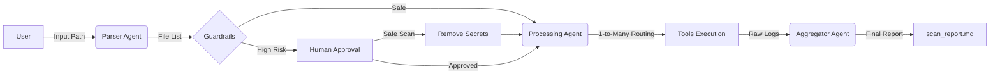

# 🛡️ RepoGuard: Neuro-Symbolic Security Agent

**RepoGuard** is an advanced autonomous AI agent designed to audit codebases for security vulnerabilities, exposed secrets, and code quality issues.

Unlike traditional static analysis tools that blindly scan every file, RepoGuard uses a **Multi-Agent Neuro-Symbolic Architecture**. It combines the reasoning capabilities of Large Language Models (LLMs) to understand context and intent, with the reliability of deterministic industry-standard tools (Ruff, Detect-Secrets) to execute precise scans.

It features **Human-in-the-Loop (HIL)** controls for high-risk operations and an **Automated Evaluation Suite** to prevent hallucinations.

---

## Key Features

* **Multi-Agent Orchestration:** A sequential chain of specialized agents (Parser → Guardrails → Processor → Aggregator) built with **LangGraph**.
* **Intelligent Routing:** Uses "1-to-Many" routing logic. A single file can be routed to multiple tools simultaneously (e.g., a Python file is checked for *both* syntax errors and hardcoded secrets).
* **Human-in-the-Loop (HIL):** The agent autonomously pauses and requests user approval before processing high-risk files (like `.env` or auth logic). Includes a "Safe Scan" mode to auto-sanitize inputs.
* **Automated Evaluation Suite:** Includes a built-in `evaluate.py` script that uses a secondary "Judge LLM" (GPT-4o-mini) to grade the agent's reporting accuracy and hallucination rate.
* **Deep Analysis:**
    * **Python:** Syntax & Logic checks via Ruff.
    * **Secrets:** Entropy and pattern-based secret detection.
    * **Markdown:** Documentation standards and formatting validation.

---

## Architecture

RepoGuard operates as a state-based graph application:



## The Agent Squad

* **Parser Agent:** Intelligently maps the target directory, ignoring noise (binaries, .venv) and handling user intent.
* **Guardrails:** A safety layer that flags sensitive files (.env, id_rsa) and triggers the Human-in-the-Loop intervention.
* **Processing Agent:** The "Router." It inspects each file and selects the correct combination of tools (e.g., ["python", "secrets"] for main.py).
* **Aggregator Agent:** A writer agent that synthesizes raw JSON tool logs into a professional, actionable Markdown report.

---

## Installation
**Prerequisites**
* Python 3.10+
* Git

1. Clone the Repository
```
git clone https://github.com/VatsalSangani/repoguard.git
cd repoguard
```
2. Install Dependencies
```
pip install -r requirements.txt
```

3. Setup Environment Variables
Create a .env file in the root directory:
```
OPENAI_API_KEY=sk-proj-your-key-here
# Optional: Enable tracing for debugging
LANGCHAIN_TRACING_V2=true
```

---

## Usage and Demo
**Run a Security Scan**
To start the interactive agent:
```
python agents/main_agent.py
```
* **Interactive Mode:** The agent will ask for a folder path.
* **Safe Mode:** If it detects secrets, it will ask: "[Y]es, [S]afe Scan, or [N]o?"
* **Output:** Findings are saved to scan_report.md.


---

## Run the Evaluation Suite
To verify the agent's logic against a golden dataset:
```
# 1. Generate the test data (includes binaries & fake secrets)
python create_test_repo.py

# 2. Run the evaluator
python evaluate.py
```
**What it does:** Runs the agent in headless mode against test_repov3_stress and uses an LLM Judge to score the output (0-100).

---

## Project Structure
```
/
├── agents/                 # The "Brain" (LangGraph Nodes)
│   ├── main_agent.py       # Entry point & Graph Definition
│   ├── parser_agent.py     # File discovery & filtering
│   ├── guardrails.py       # Safety logic & Risk detection
│   ├── processing_agent.py # Tool routing logic
│   ├── aggregator_agent.py # Report generation
|   └── schemas.py          # Pydantic Models (Data Contracts)
├── tools/                  # The "Body" (Tool Drivers)
│   └── tools.py            # Wrappers for Ruff, Detect-Secrets
├──mcp_drivers/             # The MCP brain
|   └── mcp_driver.py       # Script for ruff_mcp_driver
├── evaluate.py             # Automated Testing & LLM-as-a-Judge
├── create_test_repo.py     # Test Data Generator
├── requirements.txt        # Dependencies
├── state.py                # Shared Memory Schema (LangGraph State)
└── scan_report.md          # Output Artifact
```

---

## Evaluation Metrics
We measure the agent's performance on 4 key metrics:
1. **Recall:** Did it find 100% of the hidden secrets?

2. **Robustness:** Did it handle binary files and deep nesting without crashing?

3. **Tool Accuracy:** Did it select the correct tools (e.g., scanning dangerous.py for both syntax and secrets)?

4. **Faithfulness:** Did the final report accurately reflect the logs without hallucination? (Measured by LLM Judge).

---

## Future Roadmap
* **Docker Support:** Containerize the tool for CI/CD pipelines.

* **Custom Policies:** Allow users to define custom "Risk Rules" via a config file.


