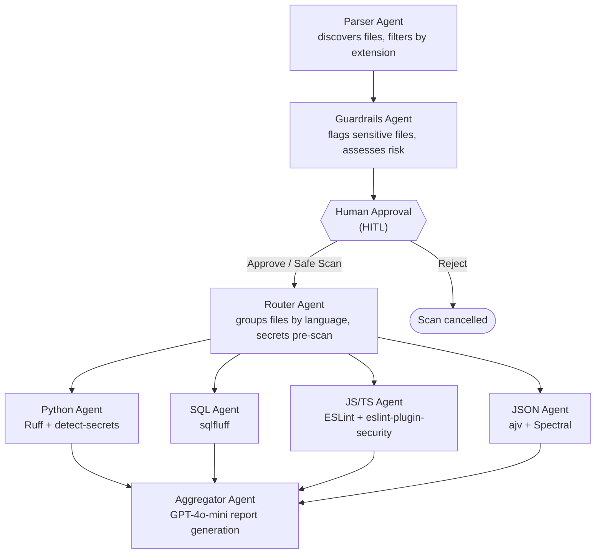

# RepoGuard

Multi-agent code security scanner built with LangGraph and MCP.

## Architecture


```mermaid
flowchart TD
    Parser["Parser Agent<br/>discovers files, filters by extension"]
    Guardrails["Guardrails Agent<br/>flags sensitive files, assesses risk"]
    HITL{{"Human Approval<br/>(HITL)"}}
    Router["Router Agent<br/>groups files by language, secrets pre-scan"]
    PyAgent["Python Agent<br/>Ruff + detect-secrets"]
    SqlAgent["SQL Agent<br/>sqlfluff"]
    JsAgent["JS/TS Agent<br/>ESLint + eslint-plugin-security"]
    JsonAgent["JSON Agent<br/>ajv + Spectral"]
    Aggregator["Aggregator Agent<br/>GPT-4o-mini report generation"]

    Parser --> Guardrails --> HITL
    HITL -->|Approve / Safe Scan| Router
    HITL -->|Reject| End(["Scan cancelled"])
    Router --> PyAgent --> Aggregator
    Router --> SqlAgent --> Aggregator
    Router --> JsAgent --> Aggregator
    Router --> JsonAgent --> Aggregator
```

Text form: `Parser → Guardrails → HITL → Router → [Python Agent | SQL Agent | JS Agent | JSON Agent] → Aggregator`

Only sub-agents for languages actually present in the target repo run — the Router dynamically fans out to a subset of `{Python, SQL, JS, JSON}` agents, and the Aggregator waits only on the branches that were dispatched.

## Features

- **Multi-language support** — Python, SQL, JavaScript/TypeScript, and JSON, each routed to a dedicated sub-agent.
- **MCP tool integration with wire logging** — every MCP JSON-RPC call (`initialize`, `tools/list`, `tools/call`) is logged to `logs/{run_id}/mcp_wire.jsonl` with full request/response envelopes and latency.
- **Human-in-the-loop approval** — the pipeline pauses before scanning for an explicit choice: Approve Full Scan, Safe Scan (exclude sensitive files), or Reject.
- **Scan coverage verification** — cross-checks the Router's file manifest against actual tool results so a sub-agent that silently fails to complete is caught and reported, not lost.
- **LangSmith tracing with custom metadata** — every run is tagged with `run_id`, `repo_name`, and `commit_sha` via `RunnableConfig`, visible on every node's trace.
- **Session reuse for performance** — each language sub-agent opens one MCP session and reuses it across every file it scans, instead of spawning a new subprocess per file.
- **F2P/P2P test suites** — 54 tests across fail-to-pass, pass-to-pass, MCP integration, state integrity, and determinism, run against real fixture repos with no mocking.

## Tech Stack

- **[LangGraph](https://github.com/langchain-ai/langgraph)** — the agent graph, state schema, and human-in-the-loop checkpointing
- **[Streamlit](https://streamlit.io/)** — the web UI
- **[FastMCP](https://github.com/jlowin/fastmcp)** — authoring the SQL/JS/JSON MCP servers
- **[LangSmith](https://smith.langchain.com/)** — tracing and observability
- **OpenAI GPT-4o-mini** — file-path interpretation and report generation

## MCP Tools

| Tool | Language | Purpose |
|---|---|---|
| Ruff | Python | Linting, style, and correctness checks |
| detect-secrets | All | Hardcoded credential and secret scanning |
| sqlfluff | SQL | SQL linting and anti-pattern detection |
| ESLint + eslint-plugin-security | JavaScript/TypeScript | Security-focused linting (unsafe eval, non-literal `child_process`, etc.) |
| ajv + Spectral | JSON | JSON Schema validation and OpenAPI/AsyncAPI spec linting |

## Setup

### Prerequisites

- Python 3.12+
- Node.js 20+ / npm (for the JS/JSON MCP tooling)
- An OpenAI API key
- (Optional) A LangSmith API key for tracing

### Install

```bash
git clone <this-repo-url>
cd repoguard

pip install -r requirements.txt
npm install
```

### Environment variables

Create a `.env` file in the project root:

```
OPENAI_API_KEY=sk-...
LANGSMITH_TRACING=true
LANGSMITH_ENDPOINT=https://api.smith.langchain.com
LANGSMITH_API_KEY=lsv2_...
LANGSMITH_PROJECT=repoguard
```

`LANGSMITH_*` variables are optional — the pipeline runs without them, just without tracing.

### Run

```bash
# Web UI
streamlit run app.py

# CLI
python main.py
```

## Tests

```bash
pytest tests/ -v --timeout=120
```

54 tests, no mocking — every test runs the real pipeline against real fixture repos and real MCP tool execution:

- **Fail-to-pass (`test_fail_to_pass.py`)** — every planted issue in a dirty fixture must be detected with the correct file, line, rule, and severity.
- **Pass-to-pass (`test_pass_to_pass.py`)** — clean fixtures must produce zero findings.
- **MCP integration (`test_mcp_integration.py`)** — each MCP tool tested in isolation: structured output, empty input, timeout, invalid path.
- **State integrity (`test_state_integrity.py`)** — Pydantic validation at every node boundary, no cross-agent key clobbering, correct Router dispatch.
- **Determinism (`test_determinism.py`)** — the same fixture run three times must produce identical findings.

Fixtures live in `tests/fixtures/`; expected outputs in `tests/golden/` are generated from real pipeline runs via `tests/generate_goldens.py`.

## Project Structure

```
agents/                 Graph nodes: parser, guardrails, router, aggregator
agents/lang_agents/     Per-language sub-agents (python, sql, js, json)
mcp_drivers/            MCP client drivers (base class, wire logging, per-tool drivers)
mcp_servers/            MCP stdio servers (sqlfluff, ESLint, ajv/Spectral)
tools/                  Non-MCP tool wrappers (secrets, markdown)
graph/                  LangGraph StateGraph construction
models/                 Pydantic schemas (Finding, RunMetadata)
observability/          LangSmith tracing, run metadata, run-id context
ui/                     Streamlit app (pages, components, state)
tests/                  Fixtures, golden outputs, and test suites
```

## Screenshots

*(images already present in the repo root)*

- `Repoguard Screenshot.png` — application overview
- `Demo Image 1.png`, `Demo Image 2.png`, `Demo Image 3.png` — UI walkthrough
- `Agent Workflow Architecture.png`, `Prototype Architecture.png` — architecture diagrams
- `Langsmith Tracing 1.png` – `Langsmith Tracing 4.png`, `Langsmith Tracing Results.png`, `Langsmith Results.png` — LangSmith trace examples
